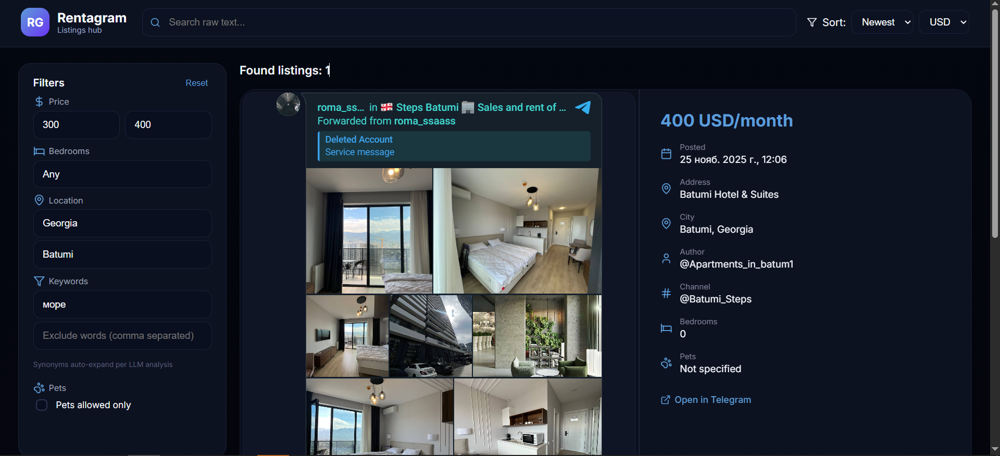

# Rent Gram

Scraper + frontend viewer for Telegram rental listings.

## What it does
- Scrapes Telegram channels (LLM-guided discovery) and writes enriched NDJSON (`out.ndjson`).
- Dedup: photo hash + text hash only (no semantic simhash). Processed UIDs tracked in SQLite.
- Analysis: LLM extracts price/currency, bedrooms/bathrooms, pets_allowed, long/short-term, amenities, district, notes.
- FX: cached via `open.er-api.com/v6` (24h TTL). Adds `analysis.price_usd` when price+currency are known.
- Metrics/state in `state.sqlite` (WAL).

## End-to-end run
Prereqs: Python 3.11+, Telethon creds, running LLM (Ollama recommended), Node 18+ (for frontend).

1) Install deps:
```bash
python -m pip install -r requirements.txt
```
2) Fill `.env`:
```
TELEGRAM_API_ID=...
TELEGRAM_API_HASH=...
TELEGRAM_SESSION=rentgram
TELEGRAM_PHONE_NUMBER=+...

LLM_BACKEND=ollama
OLLAMA_URL=http://localhost:11434
LLM_MODEL=qwen2.5:7b-instruct

STATE_PATH=state.sqlite
FX_SOURCE=https://open.er-api.com/v6
```
3) Run scraper:
```bash
python main.py --city "Batumi" --country "Georgia" --limit 10
python main.py --city "Tbilisi" --country "Georgia" --limit 10
python main.py --city "Yerevan" --country "Armenia" --limit 10
python main.py --city "Belgrade" --country "Serbia" --limit 10
python main.py --city "Moscow" --country "Russia" --limit 10
```
- Logs: stdout + `logs/run.log`
- Output: `out.ndjson` (one listing per line, with analysis+price_usd)
- State: `state.sqlite` (WAL)
4) Frontend (optional):
```bash
cd frontend
npm install
npm run dev   # opens on a free port (default 4173)
# npm run build  # to create dist/
```
Open the shown http://localhost:PORT/. The UI reads `/api/listings` (serving `out.ndjson` from the project root). If the file lives elsewhere, click "Import NDJSON" and pick it manually.

## Frontend (lo-fi browser for out.ndjson)
Lives in `frontend/` (Vite + React). Photos are not downloaded (per spec); UI shows counts/hashes only. See commands above (dev/build). Data source: tries `/api/listings` first (serve `out.ndjson` from project root via any static/file server or tiny API), falls back to `/out.ndjson` from the same host. Use "Import NDJSON" to pick a local file manually.

## Notes
- Do not download/store media; only hash on the fly for dedupe.
- Dedup requires: shared photo hash + identical normalized text hash. Text-only units are analyzed but not deduped.
- `mark_processed` happens after successful write to NDJSON to avoid losing posts on crashes.

## Screenshot


## Data format (analysis)
Each NDJSON item has `analysis` matching the spec: flags (`is_rental_offer`, `is_short_term`, `passes_city_country`, `skip_reason`), location (`city/country/confidence`), nested `price { value_raw, currency_raw, source, usd, fx_rate, fx_source, fx_ts }`, `rooms`, `bedrooms { value, confidence }`, `bathrooms`, `is_studio`, `pets`, `long_term`, `amenities`, `district`, `address`, `notes`, `lang`, and `llm { model, prompt_ver }`.
